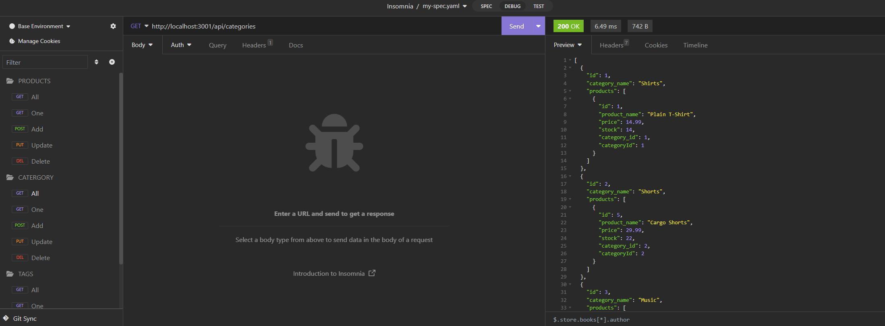

# E-Commerce Back-End

Walkthrough: URL


## Description

I wanted to created a backend database that stores the products based on what catergory it falls under and the tags relating to the product. Through this project, I was able to understand how tables work. I also was able to learn how to get the items, post new items, put the updated item in the table and delete it from the table. 

## Table of Contents (Optional)

If your README is long, add a table of contents to make it easy for users to find what they need.

- [Installation](#installation)
- [Usage](#usage)
- [Credits](#credits)
- [License](#license)

## Installation

Only installations needed is `npm install` for the node modules.

## Usage

To use, you will need Insomnia or any application related to it to view how this project works. You can also review it in the walkthrough link provided at the top to view how it works.

## Credits

N/A

## License

N/A

## Badges

N/A

## Features

N/A

## How to Contribute

N/A

## Tests

To test, create a dotenv file with these info inputted:
```
DB_NAME='ecommerce_db'
DB_USER='root'
DB_PASSWORD='your password here'
```

Then create the database by directing into the db file in the command line: `cd db` then type `mysql -u root -p` and input your password.

In mysql, type `source schema.sql` and you should be connected!

After that, direct out of the db file by `cd ..` and type `node server.js` and you can see the site in `localhost:3001`